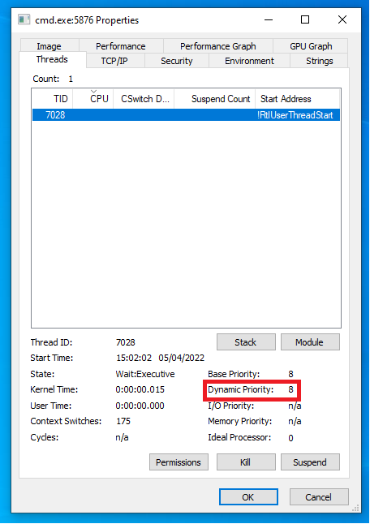
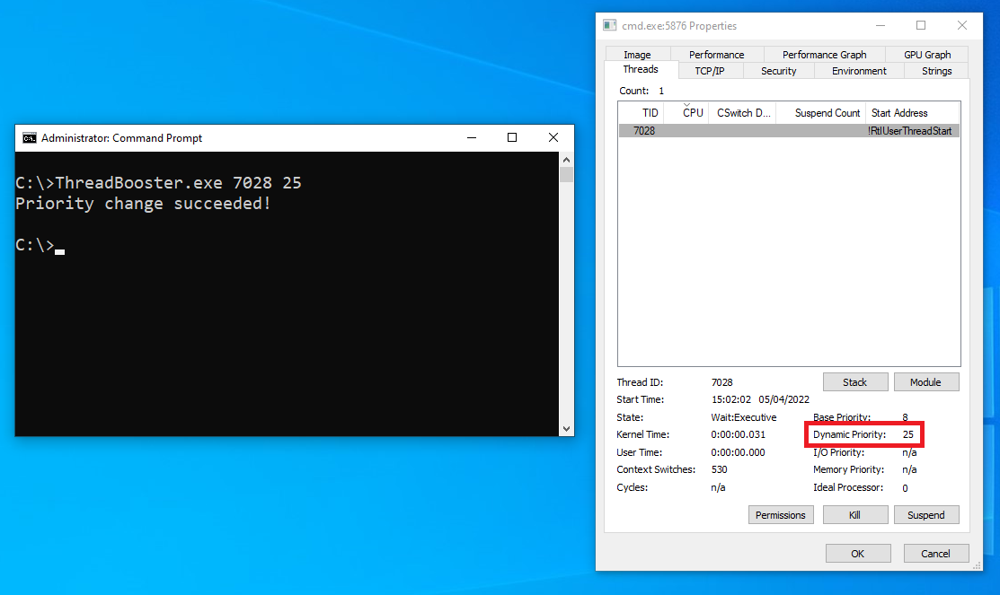

# Thread Priority Booster

Allows you to change the thread's dynamic priority of any thread. The projects is powered by a kernel driver and a usermode console application.

This project was made as a learning opportunity based on the [Windows Kernel Programming by Pavel Yosifovich](https://www.amazon.com/Windows-Kernel-Programming-Pavel-Yosifovich/dp/1977593372) initial chapters.

# Instalation
The driver has to be installed on a machine with test signed enabled. Run the following command from an elevated windows terminal:

    bcdedit -set TESTSIGNING ON

Proceed to restart your machine for the effects to take action.

Now we can install our driver service.
    
    sc create booster type= kernel binPath= path\to\driver\PriorityBooster.sys
    sc start booster

After installing and starting the booster service we can now run the usermode application:

    ThreadBooster.exe <threadid> <priority>

# Example
We can check the priority of a thread using Process Explorer from SysInternals. As we can see on the image below, the thread 7028 has a dynamic priority level 8.

After we run our usermode app giving it the thread ID and the new priority level we can see now the thread has a dynamic priority level of 25.

